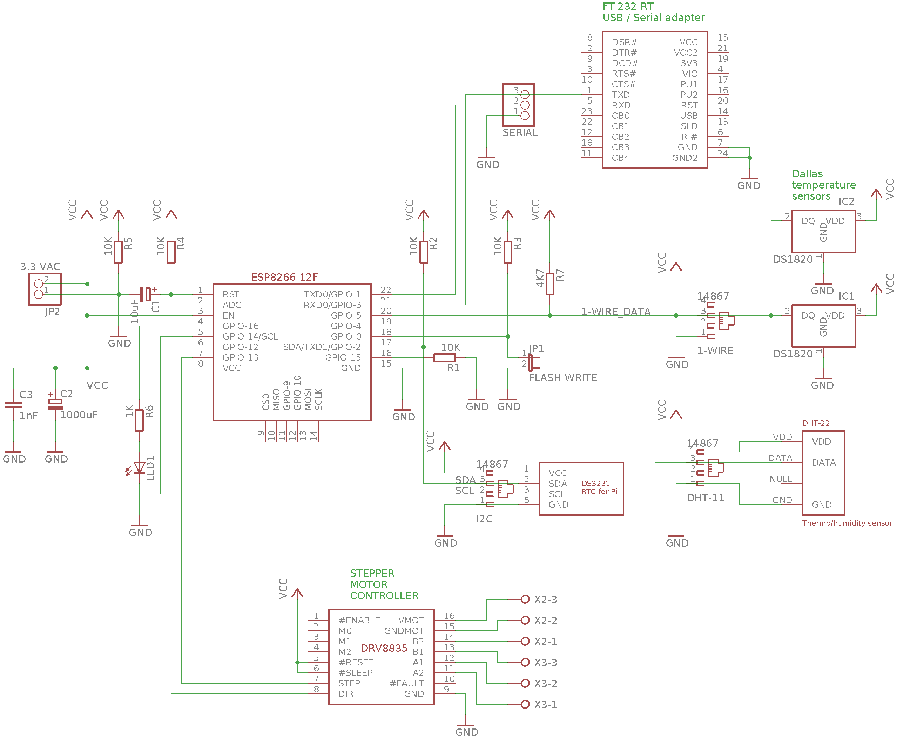

th_sensor
=========

Axon sensor module to measure temperature and humidity

This is a firmware repository of an [axon component](https://github.com/tombenke/axon-go),
that is a standalone hardware module.

See the [axon `th-sensor` flow example](https://github.com/tombenke/axon-go#the-th-sensor-flow)
for further details.

## Platform

The firmware is based on the Arduino libraries, and designed to run on [ESP8266-12](https://en.wikipedia.org/wiki/ESP8266).

The figure below shows the schematics of the electronic circuit,
that can be used to deploy the firmware onto.


## Installation

First set the parameters in the first part of the [`axon-sensor-th.ino`](axon-sensor-th.ino) source file:

```C
    /* DHT sensor config */
    #define DHTPIN  4     // Digital pin connected to the DHT sensor 

    /* WiFi config */
    const char* WIFI_SSID = "your-wifi-ssid";
    const char* WIFI_PSK = "your-wifi-password";

    /* NATS config */
    const String AXON_ID = "25b95691"; // Unique ID for axon subjects on demo.nats.io that prevents collision
    const String DEVICE_ID = "6cfde020-fcd8-493f-9f6c-d8415b4a3fd5"; // Unique device ID
    const String TOPIC_UPSTREAM = "axon." + AXON_ID + ".log"; // The prefix and postfix to the subject of outgoing messages
    const String TOPIC_DOWNSTREAM = "axon." + AXON_ID + ".measure"; // The prefix and postfix to the subject of outgoing messages

```

Then compile and upload with the [Arduino ID](https://www.arduino.cc/en/main/software).
